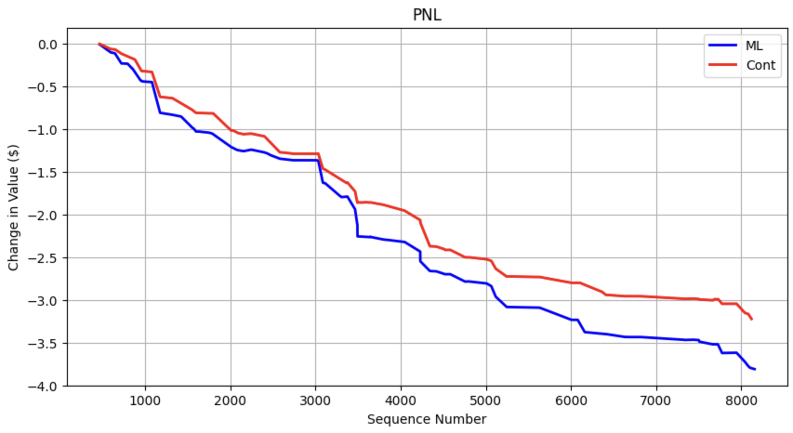

# Machine Learning Avelleneda Stoikhov Market Maker
## About
This repo is a paper market making simulator to test the live performance of custom market making algorithms against the popular Avelleneda Stoikov algorithm. The custom market making algorithm in this repo is a machine learning algorithm that is built upon the standard Avellenda Stoikov algorithm. The ML algo predicts the price movement of an asset. If the asset is predicted to move up in price, we modify the Avellenda Stoikov model to long the asset (more aggressive buying); if the price is to move down, we short the asset (more aggressive selling) This simulator is connected to the Coinbase exchange, but in theory, can be applied to any exchange and any asset class. You can plug and play any machine learning binary classifier to see its performance. The binary classifier should be trained to predict when the mid price will go up and when it will go down, and the simulator will show how accurately it will be able to do so. NOTE: This simulator should not be used to test PnL performance because this simulator does not account for volume of orders on the orderbook; the Advanced version on my repo page does this; this simulator only shows how accurately the binary classifier can predict price movement.

## Workflow
### Connecting to Exchange
The simulation starts with reading in exchange data through websocket.py. Each exchange has different websocket APIs; currently, websocket.py is configured to read in data from Coinbase exchange. You have to provide your own API name and secret key to connect to each exchange. After the keys are plugged in, the websocket will continually read in updates and place each update into the `WebSocket.ws_updates_queue`, which is also accessible by `Simulator`.

### Updating Orderbook
After the `WebSocket` places each update on `WebSocket.ws_updates_queue`, the `Simulator` processes each update from `Simulator.websocket_updates_queue` in `Simulator.process_msg(msg)`, where `msg` is an orderbook update. In `Simulator.process_msg(msg)`, the function calls `OrderBook.process_updates(updates)`, which updates `OrderBook`. `OrderBook` contains real-time orderbook data from whichever exchange and asset `WebSocket` is connected to. 

### Predicting Price Movement
After the orderbook is updated, we predict the price movement. If price is to move up, we set the target inventory number appropriately to be exposed to potential gains. If price is to move down, we set the target inventory number appropriately to avoid potential losses. After plugging in appropraite numbers into the Avelleneda Stoikhov algorithm, we obtain the bid and ask prices. 

### Buying and Selling Positions
With the bid and ask prices, in the next round of updates, we see if the orderbook has recieved any marketable orders, that is if our bid price >= ask prices in the order book, and if our ask price <= bid prices in the orderbook. Processing marketable orders, we update our portfolio accordingly. If we buy orders, we increase the inventory of our portfolio. If we sell orders, we decrease our inventory. After processing marketable orders, we recalculate our exposed value by mid_price * inventory.

## Machine Learning & QR
All of the machine learning exists within `model.py` and `research.ipynb`. Feature engineering and model training is done in `research.ipynb`. Then, the model is imported into `model.py` and the feature engineering code for the inference vector is in `model.py`. Whenever a new model is plugged into `model.py`, we also have to change the code under `BinaryClassifier.create_inference_vector(bids, asks, timestamp_str)`, to reflect the appropriate inference vector for a new binary classifier.

### Personal Research and Outcomes
The ML model is the same model from Machine Learning Paper Trading Simulator (simple). If the model outputs that the asset will go up in price, we increse the target inventory and decrease the risk aversion (make more aggressive buys). The performance is not better compared to the traditional stoikhov model with fixed parameters. This is still a work in progress.

simulation_2_3_update_lag_xgbclassifier2
